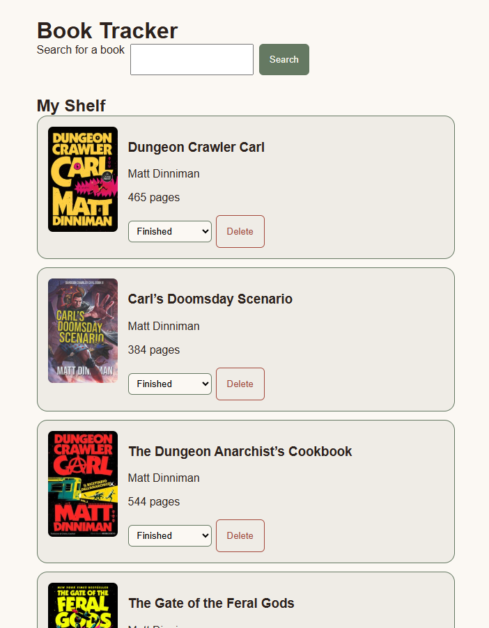

# Book Tracker
This program takes information about books from Open Library's API. It allows users to search for and save books on a bookshelf and displays relevant information. I started building this so I could keep track of what I've read and what I'm reading now, with plans to add list sharing in the future.

[Live site](https://j-winchester94.github.io/book-tracker/)

## Features
- Accounts for users that are listening to Audiobooks
- Displays percentage of book completed
- Users can manually enter page counts if none are provided by the API
- Automatically saves between visits
- Connects to Open Library's API and allows users to search for books
- Users can add books to a bookshelf
- Users can choose if they have finished, are currently reading, or have yet to read.
- Prevents duplicates of the same book from being added to the list
- Allows users to see their progress on a progress bar if they have a book marked as one that they are currently reading
- Inputs and labels for audiobooks and books with pages automatically change depending on the format selected.

## Built with
- HTML5
- CSS
- Vanilla JavaScript
- localStorage
- [Open Library's book search API](https://openlibrary.org/dev/docs/api/search)

## What I learned
I learned a lot about converting between hours and minutes using Math.floor and the remainder operator. I learned how to fetch data from an API using async and await, and how to handle incomplete data, such as missing book covers. I also learned a bit more about saving data using localStorage. 

## Future Improvements
- Sharing a reading list with others
- Reading stats, such as total pages read and books finished this year
- Fixing a known issue: when a book is removed from the shelf, its search result still says "On shelf" until the next search